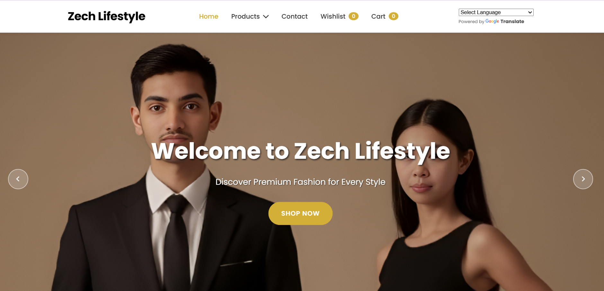
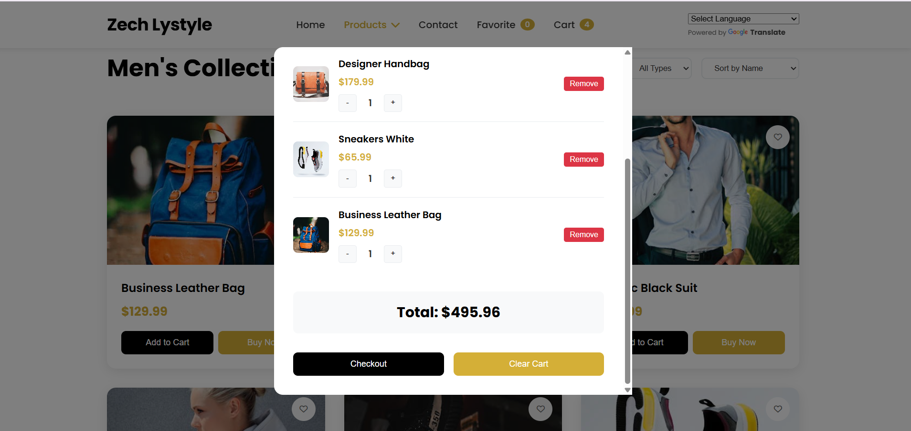

# 🛍️ Zech Lifestyle

**Zech Lifestyle** is a modern shopping cart interface for a fashion and lifestyle eCommerce website. Built using **HTML, CSS, and JavaScript**, this front-end project features a clean UI, responsive layout, and dynamic shopping cart and wishlist functionality.

---

## 📸 Preview

---

## ✨ Features

- 🛒 Add to Cart, Remove, and Clear Cart functionality
- ❤️ Wishlist system with item counter
- 📦 Quantity control (increase/decrease item count)
- 🖼️ Category-based product display
- 🌐 Google Translate dropdown for multilingual access
- 📱 Fully responsive design for all screen sizes

---

## 📁 Project Structure

